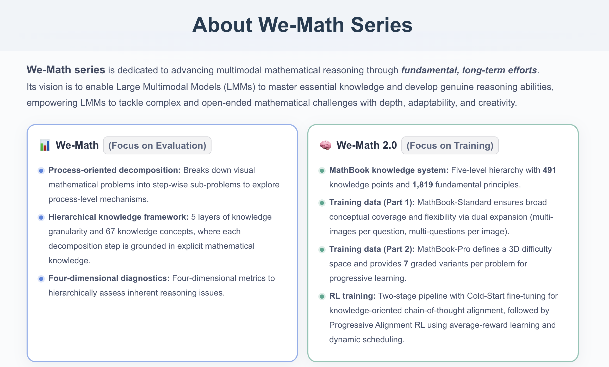
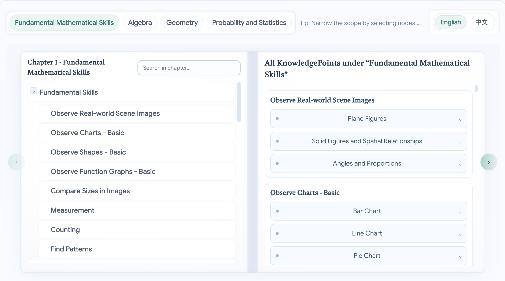
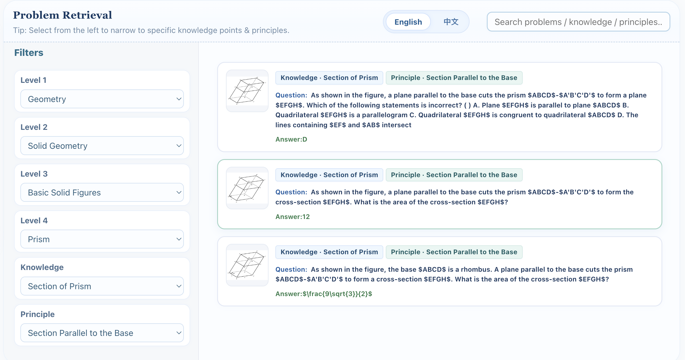
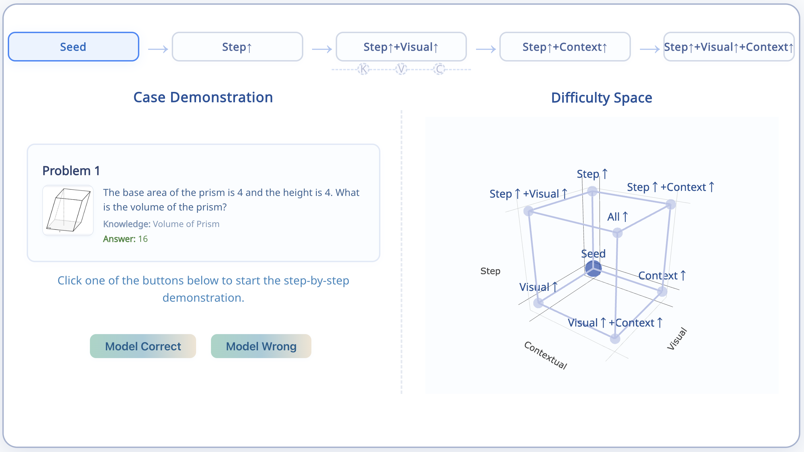

<div align="center"> 

## [We-Math 2.0: A Versatile MathBook System for Incentivizing Visual Mathematical Reasoning](https://arxiv.org/abs/2508.10433) 


[](https://arxiv.org/abs/)
[](https://huggingface.co/papers/)
[](https://opensource.org/licenses/MIT) 
[](https://www.python.org/downloads/release/python-390/) 
 
</div>


<p align="center">
🤗 <a href="https://huggingface.co/datasets/We-Math/We-Math2.0-Standard" target="_blank">MathBook-Standard</a> ｜
🌐 <a href="https://we-math2.github.io/" target="_blank">Webpage</a> ｜
🤗 <a href="https://huggingface.co/datasets/We-Math/We-Math2.0-Pro" target="_blank">MathBook-Pro</a> ｜
</p>

<p align="center">
     <br>
</p>

---

> ✨ Stay tuned — we will continue to share updates as our work on multimodal reasoning progresses!

- [**We-Math 2.0**](https://arxiv.org/abs/2508.10433) (Preprint 2025) - We-Math 2.0: A Versatile MathBook System for Incentivizing Visual Mathematical Reasoning
- [**We-Math**](https://arxiv.org/abs/2407.01284) (ACL 2025) - We-Math: Does Your Large Multimodal Model Achieve Human-like Mathematical Reasoning?


## 📣 News

**[2025.08.15]** 🌐 **We-Math 2.0 homepage is live at [we-math2.github.io](https://we-math2.github.io/)**. 🚀

**[2025.08.15]** 📄 **We-Math 2.0 paper is now available on [arXiv](https://arxiv.org/abs/2508.10433)**. 🚀

**[2025.08.15]** 📦 **We-Math 2.0 dataset is now available on [Hugging Face Datasets](https://huggingface.co/datasets/We-Math/We-Math2.0-Standard)**. 🚀

**[2025.05.16]** 🎉 We-Math is accepted by ACL 2025 🎉

**[2025.02.20]** 🎉 We-Math is officially supported by [VLMEvalKit](https://github.com/open-compass/VLMEvalKit) for fast evalution 🚀.

**[2024.07.02]** We-Math is accessible at https://arxiv.org/abs/2407.01284.

**[2024.07.02]** The We-Math dataset is accessible at [Huggingface Datasets](https://huggingface.co/datasets/We-Math/We-Math/).

**[2024.07.02]** The We-Math homepage can be accessed at https://we-math.github.io/.


## 📑 Contents

- [**Overview (We-Math 2.0)**](#overview)
- [**Quick Start**](#quick-start) 
- **Cold-Start SFT Stage**
  - [1. Environment Setup (SFT)](#1-environment-setup-sft)
  - [2. Fine-Tuning](#2-fine-tuning)
- **Progressive Alignment RL**
  - [1. Environment Setup (RL)](#1-environment-setup-rl)
  - [2. RL Training](#2-rl-training)
    - [2.1 Pre-aligned RL *(MathBook-Standard)*](#21-pre-aligned-rl-mathbook-standard)
    - [2.2 Dynamic Scheduling RL *(MathBook-Pro)*](#22-dynamic-scheduling-rl-mathbook-pro)
   
---

## 💡 Overview (We-Math 2.0)

**We-Math 2.0** is a unified system designed to comprehensively enhance the mathematical reasoning capabilities of Multimodal Large Language Models (MLLMs).  
It integrates a **structured mathematical knowledge system**, **model-centric data space modeling**, and a **reinforcement learning (RL)-based training paradigm** to achieve both broad conceptual coverage and robust reasoning performance across varying difficulty levels.

The key contributions of **We-Math 2.0** are fourfold:  
1. **MathBook Knowledge System** — A five-level hierarchical structure encompassing *491 knowledge points* and *1,819 fundamental principles*.  
2. **MathBook-Standard & MathBook-Pro** — MathBook-Standard ensures wide conceptual coverage and flexibility via dual expansion, while MathBook-Pro defines a **three-dimensional difficulty space** and generates *7 progressive variants per problem* for robust training.  
3. **MathBook-RL** — A two-stage RL framework comprising *Cold-Start Fine-tuning* for knowledge-oriented chain-of-thought alignment, and *Progressive Alignment RL* with average-reward learning and dynamic data scheduling for gradual alignment across difficulty levels.  
4. **MathBookEval** — A comprehensive benchmark covering all 491 knowledge points with diverse reasoning step distributions.

Extensive experiments show that **MathBook-RL** consistently outperforms existing baselines on four widely-used benchmarks and achieves strong results on MathBookEval, demonstrating superior generalization in mathematical reasoning.

---

### MathBook Knowledge System

<p align="center">
    
</p>

The **MathBook Knowledge System** is organized as a five-level hierarchy covering *491 knowledge points* and *1,819 fundamental principles*.  
It is systematically derived from trusted sources such as Wikipedia and open-source textbooks, refined through hierarchical clustering, and further revised by human experts to ensure accuracy and completeness.

You can visit our [project website](https://we-math2.github.io/#title-knowledge) to explore the complete knowledge system.

---

### MathBook-Standard

Building on the MathBook Knowledge System, **MathBook-Standard** is a dataset featuring comprehensive principle-level knowledge annotations and carefully curated problems to ensure broad, balanced coverage across mathematical domains, with particular focus on underrepresented areas.

To foster deeper conceptual understanding, MathBook-Standard employs a **dual-expansion strategy**:  
- *multi-images per question*  
- *multi-questions per image*  

This enables the creation of diverse problem sets that promote conceptual flexibility and adaptability.

Below, we present an example of the **multi-images-per-question** component of the dataset, which can be retrieved via its underlying knowledge principles.  
You can view the full collection on our [project website](https://we-math2.github.io/#title-standard).

<p align="center">
    
</p>

---

### MathBook-Pro

Building on the MathBook Knowledge System, **MathBook-Pro** introduces a pivotal **three-dimensional difficulty modeling framework** that systematically characterizes mathematical problem complexity from a **model-centric** perspective.  
Each seed problem is positioned within a structured difficulty space defined by three orthogonal axes:

- **Step Complexity** – Reasoning depth is quantified by the number of knowledge points involved. More complex variants incorporate additional intermediate conclusions, with the most advanced cases involving at least six knowledge points drawn from the MathBook Knowledge System.  
- **Visual Complexity** – Additional elements such as auxiliary lines or altered geometric configurations are introduced via **GeoGebra**, while preserving the original core structure.  
- **Contextual Complexity** – Concise mathematical statements are rephrased into richer real-world contexts or linguistically abstract scenarios, increasing the semantic and interpretive demands of the problem statement.

By varying a single dimension at a time and progressively composing transformations across multiple dimensions, each seed problem is expanded into **seven progressive difficulty levels**.  
This enables structured, gradual learning for MLLMs and creates a robust foundation for enhancing reasoning performance across varying levels of complexity.

Below, we showcase the multi-level difficulty component of MathBook-Pro, illustrating its progressive design across the three complexity dimensions.

<p align="center">
    
</p>

You can visit our [project website](https://we-math.github.io/) to see the use of **MathBook-Pro** in the **Dynamic Scheduling RL** strategy.

---

### Methodology

**Cold-Start Fine-tuning.**  
Supervised fine-tuning on **MathBook-Standard** (covering all 491 knowledge points), instilling awareness of the knowledge system and guiding knowledge-driven chain-of-thought reasoning.

**Progressive Alignment RL.**  
A curriculum-based RL procedure with two phases:

**Pre-aligned RL.**  
Using MathBook-Standard, where each group contains multiple variants of the same knowledge principle.
A mean-based reward is computed over variants sharing the same knowledge principle, encouraging reasoning consistency and robustness based on knowledge mastery rather than individual instances.

**Dynamic Scheduling RL.**  
Using MathBook-Pro, each base problem $x_0=(q_0, a_0, I_0)$ follows a progressive trajectory that increases difficulty along knowledge, visual, and contextual dimensions:

$$
x_0 \to \phi_s(x_0) \to (\phi_s \circ \phi_v)(x_0) \to (\phi_s \circ \phi_c)(x_0) \to (\phi_s \circ \phi_v \circ \phi_c)(x_0)
$$

where $\phi_s$ adds knowledge points, $\phi_v$ increases visual complexity, and $\phi_c$ increases contextual abstraction.

If the model fails at $\phi(x)$ after succeeding at $x$, we trigger incremental learning via an auxiliary set $\Delta(x,\phi)$ that isolates the newly introduced factor:

- **Knowledge Increment Scheduling:** when failure is due to added knowledge in $\phi_s$, sample auxiliary problems $x'_0$ from MathBook-Standard targeting the new knowledge point(s).
- **Modality Increment Scheduling:** when failure stems from added modality complexity ($\phi_v$ or $\phi_c$), guide the model through single-modality incremental problems that isolate the visual or contextual component.

<p align="center">
    
</p>


## 🏃 Quick Start

### ❄️ Cold-Start SFT Stage

#### 1. Environment Setup (SFT)

In this step, we will describe how to perform a cold start for the SFT stage using the [ms-swift](https://github.com/modelscope/ms-swift) repository. Please first set up the environment for ms-swift.

```bash
pip install ms-swift -U
```
#### 2. Fine-Tuning

Our SFT dataset consists of two parts: 200 pure text samples and 800 samples with associated images. Download the SFT dataset from 🤗[MathBook-SFT](https://huggingface.co/datasets/) and refer to the script below for fine-tuning.

```bash
nproc_per_node=8
NPROC_PER_NODE=$nproc_per_node \
MASTER_PORT=29500 \
MAX_PIXELS=4194304 \
CUDA_VISIBLE_DEVICES=0,1,2,3,4,5,6,7 \
swift sft \
    --model_type qwen2_5_vl \
    --model Qwen/Qwen2.5-VL-7B-Instruct \
    --num_train_epochs 1 \
    --train_type full \
    --deepspeed zero2 \
    --tuner_backend peft \
    --torch_dtype bfloat16 \
    --weight_decay 0.1 \
    --warmup_ratio 0.03 \
    --eval_steps 1000 \
    --attn_impl flash_attn \
    --output_dir checkpoint \
    --dataset mathbook_sft.jsonl \
    --per_device_train_batch_size 1
```


### 🔥 Progressive Alignment RL

#### 1. Environment Setup (RL)
you can install our additional environment as follow:

```bash
pip install -r requirements.txt
```

#### 2. RL Training

Both RL stages are developed based on the [EasyR1](https://github.com/hiyouga/EasyR1) codebase to fit our workflow.

For data preparation, you can directly download Parquet-format datasets from [🤗MathBook-Standard](https://huggingface.co) for training.

##### 2.1 Pre-aligned RL (MathBook-Standard)

```bash
cd pre_align

python3 -m verl.trainer.main \
    config=pre_align_r1v.yaml \
```

##### 2.2 Dynamic Scheduling RL (MathBook-Pro)

```bash
cd dynamic_scheduling

python3 -m verl.trainer.main \
    config=dynamic_scheduling_r1v.yaml \
```
#### Merge Checkpoint in Hugging Face Format
```bash
python scripts/model_merger.py --local_dir checkpoints/easy_r1/exp_name/global_step_1/actor
```


## 📜 License

Our dataset are distributed under the [CC BY-NC 4.0](https://creativecommons.org/licenses/by-nc/4.0/) license.


## 📄 Cite

If you find **We-Math 2.0** useful for your your research and applications, please kindly cite using this BibTeX:

```bibtex

```

## 📞 Contact

For any questions or feedback, please reach out to us at [qrq@bupt.edu.cn](qrq@bupt.edu.cn) or [qiunatan@bupt.edu.cn](qiunatan@bupt.edu.cn).
